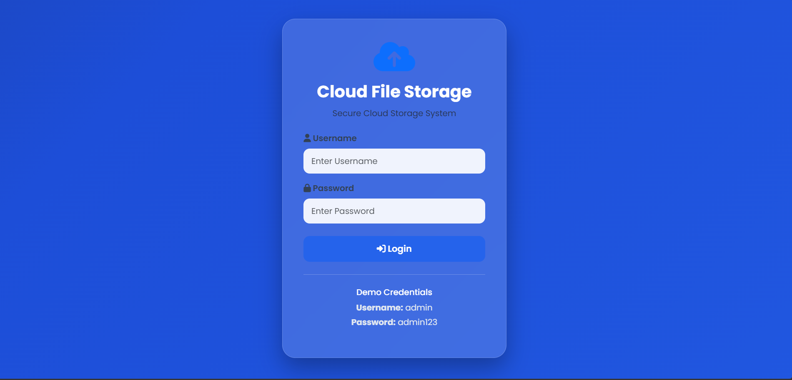
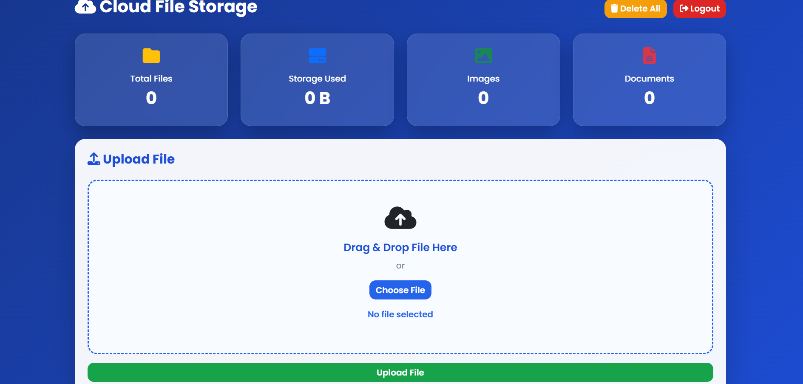
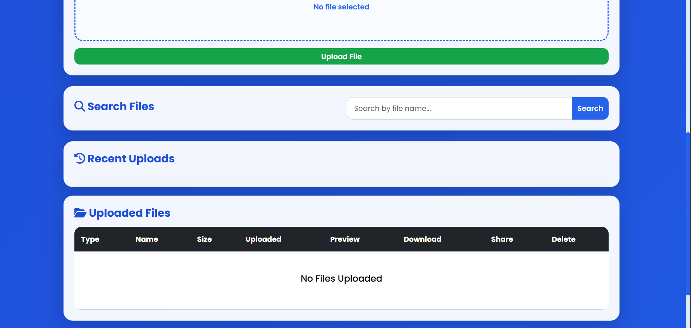

# ☁️Cloud File Storage System

> 📂 A secure web-based application for uploading and managing files, developed for the CODSOFT Cloud Computing Internship — Task 1.

## 🚀 Live Demo

🟡 **Live Demo: https://cloud-file-storage-goutham.onrender.com

## ✨ Key Features

- 🔐 Secure Login
- 📤 File Upload
- 👁️ File View / Management
- ⬇️ File Download
- 🗑️ File Delete
- ✅ File Validation
- 🔒 Basic Access Control
- 📱 Responsive Web Interface

## 🎯 CODSOFT Task 1

The task requires a cloud-based application for uploading and managing files, with secure upload/download/view/delete operations, file validation, basic access permissions, and cloud storage such as AWS S3, Azure Blob Storage, or Google Cloud Storage. Shareable download links are listed as a bonus feature. 

## 🛠️ Technologies Used

| Technology | Purpose |
|---|---|
| 🐍 Python | Backend |
| 🌐 Flask | Web framework |
| 🎨 HTML5 | Frontend |
| 💅 CSS3 | Styling |
| ⚡ JavaScript | Client-side interactions |
| 🅱️ Bootstrap | Responsive UI |
| ☁️ Cloud Storage | File persistence |

## 📸 Screenshots

Create a `screenshots/` folder:

```text
screenshots/
├── login.png
├── dashboard.png
├── upload.png
```

### 🔐 Login Page


### 🏠 Dashboard


### 📤 Upload


## 🔄 File Workflow

```text
👤 User
   │
   ▼
🔐 Login
   │
   ▼
📤 Upload File
   │
   ▼
✅ Validate
   │
   ▼
☁️ Store
   │
   ├── 👁️ View
   ├── ⬇️ Download
   └── 🗑️ Delete
```

## 🔐 Security

- File-type validation
- Secure file handling
- Authenticated access
- Controlled file operations
- Input validation

## ⚙️ Run Locally

```bash
git clone https://github.com/goutham2529/CODSOFT_TASK1.git
cd CODSOFT_TASK1
pip install -r requirements.txt
python app.py
```

Open:

```text
http://127.0.0.1:5000/
```

## ☁️ Cloud Deployment

The official task specifies cloud storage such as AWS S3, Azure Blob Storage, or Google Cloud Storage. Configure the selected provider and credentials through environment variables for production deployment.

## 🎓 Internship

**CODSOFT Cloud Computing Internship**

### Task 1 — Cloud File Storage System

## 👨‍💻 Author

**Goutham**  
Computer Science Engineering — Data Science

**Repository:** https://github.com/goutham2529/CODSOFT_TASK1
